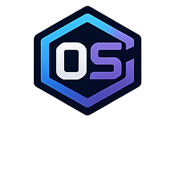
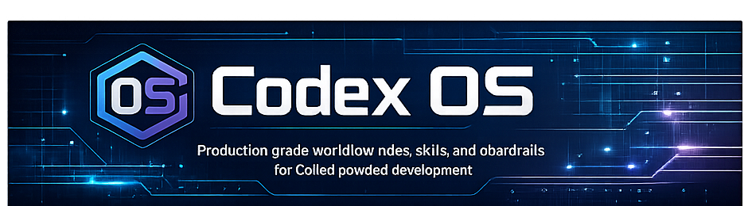

<p align="center">
  
</p>



# Codex OS


> Production-grade workflow rules, skills, and guardrails for Codex-powered development.

Transform Codex from a code generator into a disciplined engineering agent.

[Installation](#installation) • [Philosophy](#philosophy) • [Included Skills](#included-skills) • [Roadmap](#roadmap)

---

## Why Codex OS Exists

Most AI coding failures are not caused by weak models.

They are caused by weak workflows.

Common failure modes:
- Hidden assumptions
- Overengineering
- Scope creep
- Unsafe command execution
- Unverified "fixes"

Codex OS addresses these with production-oriented workflow engineering.

---

## Philosophy

Codex OS is built around four principles:

### Think Before Coding
Never silently assume.

### Simplicity First
Solve the present problem only.

### Surgical Changes
Minimize blast radius.

### Goal-Driven Execution
Never claim success without verification.

---

## Architecture

```text
AGENTS.md   -> Global behavioral defaults
rules/      -> Execution guardrails
skills/     -> Task-specific workflows
```

---

## License

MIT
